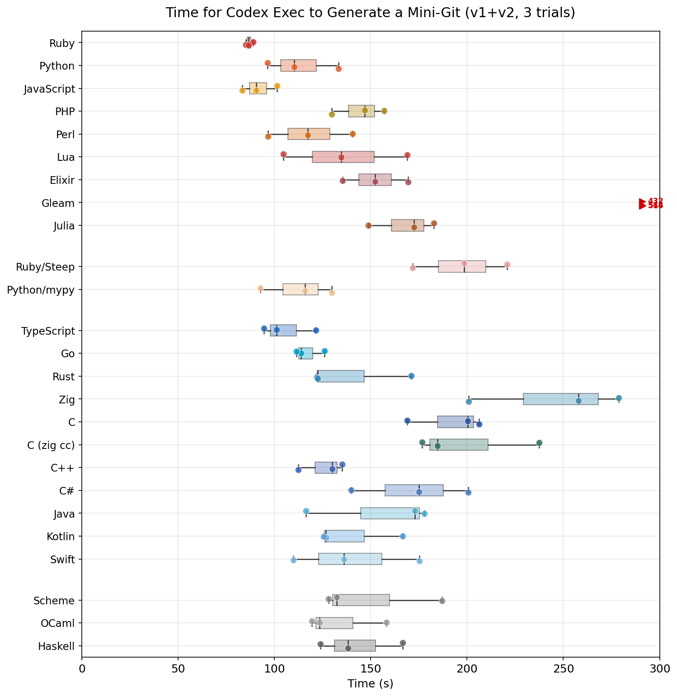
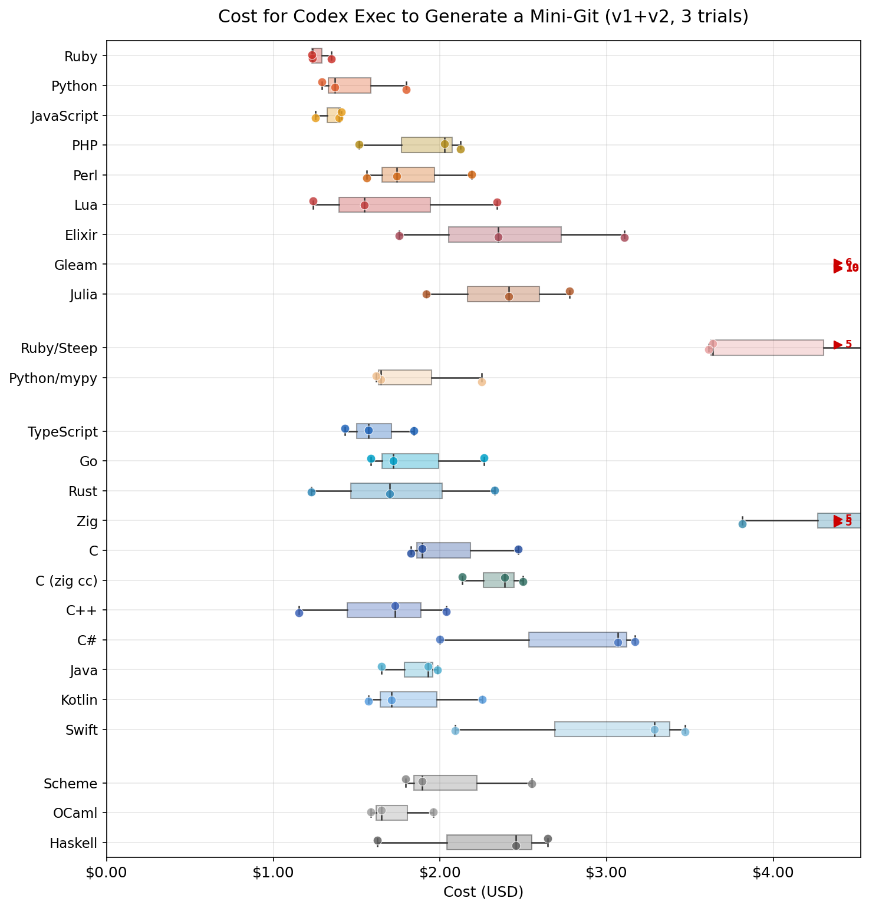
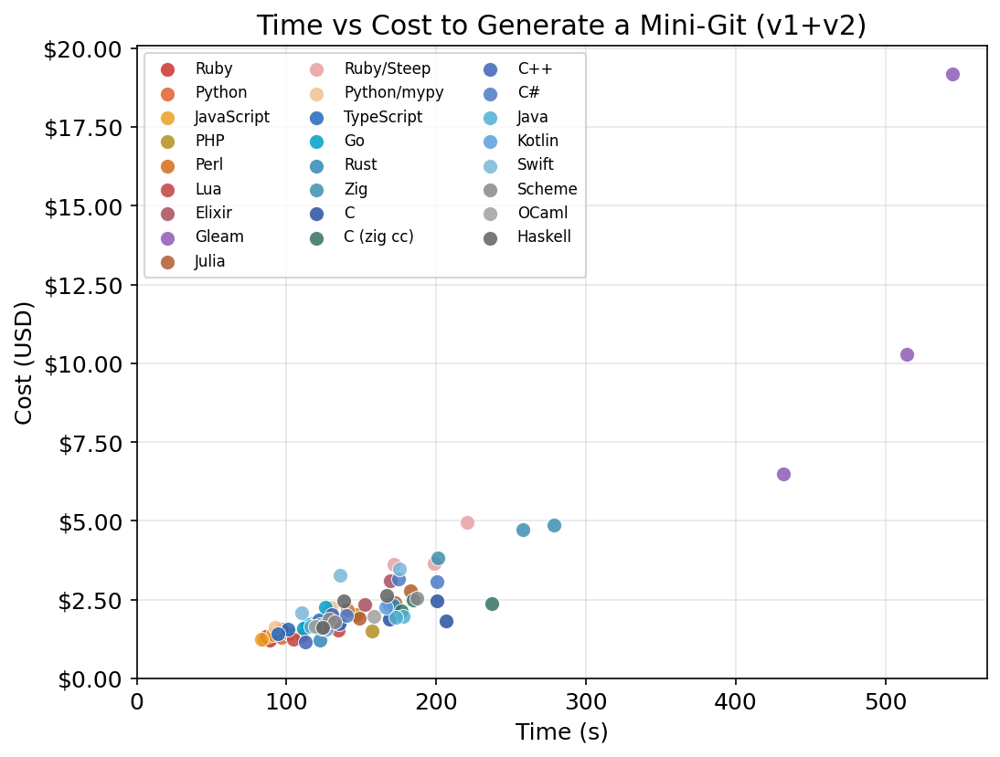
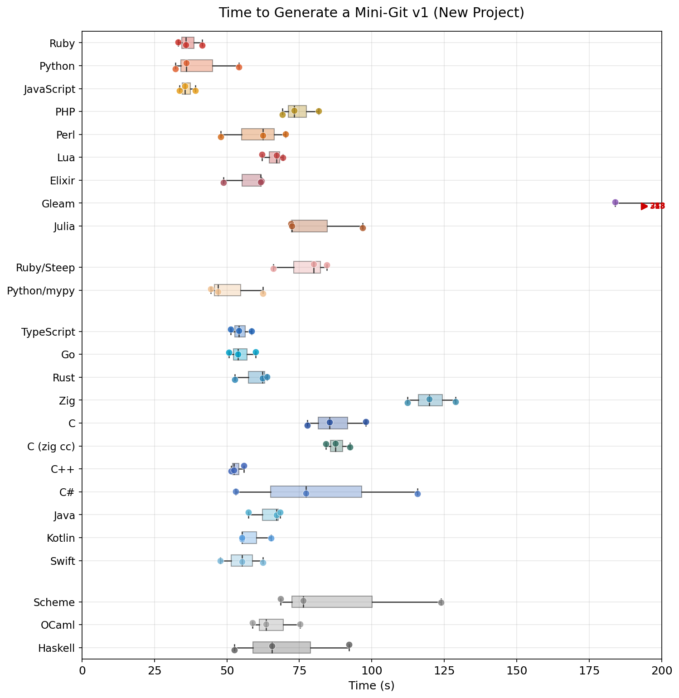
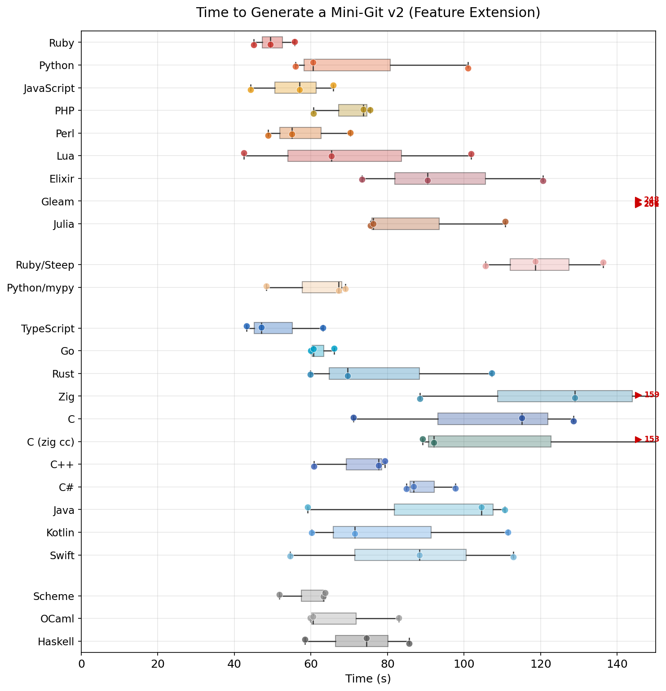

# Which Programming Language Is Best for AI Coding Agents?

This repository benchmarks how quickly and cheaply Codex Exec can implement the same small program across many languages.

The task is a two-phase "MiniGit" exercise:
- `v1`: build `init`, `add`, `commit`, and `log` from scratch
- `v2`: extend the passing `v1` workspace with `status`, `diff`, `checkout`, `reset`, `rm`, and `show`

The current checked-in results are a March 2026 snapshot:
- runner: Codex Exec (`codex-cli 0.111.0`)
- model: `gpt-5.4`
- reasoning effort: `medium`
- service tier: `fast`
- trials: `3` per language
- configurations: `25`
- toolchains: see [results/meta.json](./results/meta.json)

These checked-in results were run with `gpt-5.4` at `medium` reasoning effort. The benchmark command itself still inherits model settings from local Codex config unless you pin them explicitly.

## TL;DR

- Ruby won cleanly: fastest overall, cheapest overall, and by far the most stable.
- JavaScript and TypeScript formed the rest of the front pack. On this run, TypeScript beat Python.
- Every language passed every test in every trial. For Codex, this benchmark mostly measures latency and token budget, not recovery from failure.
- Static typing was not a universal tax. `python/mypy` was basically tied with plain Python on wall-clock time, while `ruby/steep` was dramatically slower and more expensive than plain Ruby.
- `zig cc` did not improve the C results over GCC here.
- Gleam passed, but it was still an extreme outlier in time, cost, and token volume even after fixing its LOC accounting to exclude generated/template files.

## Setup

Each run asks the agent to read [SPEC-v1.txt](./SPEC-v1.txt) or [SPEC-v2.txt](./SPEC-v2.txt), implement `minigit`, and prove correctness by passing [test-v1.sh](./test-v1.sh) or [test-v2.sh](./test-v2.sh).

Language configurations:

| Category | Languages |
|----------|-----------|
| Dynamic | Ruby, Python, JavaScript, PHP, Perl, Lua, Elixir, Gleam, Julia |
| Dynamic + checker | Ruby/Steep, Python/mypy |
| Static | TypeScript, Go, Rust, Zig, C, C (zig cc), C++, C#, Java, Kotlin, Swift |
| Functional | Scheme, OCaml, Haskell |

`python/mypy` requires strict type-checking. `ruby/steep` requires RBS and `steep check`. `c/zigcc` is the same C task but asks the agent to use `zig cc` instead of GCC or Clang.

## Results

Full tables live in [results/report.md](./results/report.md). Sorted by total time:

| Language | Tests | Total Time | Avg Cost |
|----------|------:|-----------:|---------:|
| Ruby | 123/123 | 86.9s | $1.27 |
| JavaScript | 123/123 | 91.8s | $1.35 |
| TypeScript | 123/123 | 105.8s | $1.61 |
| Python/mypy | 123/123 | 112.8s | $1.84 |
| Python | 123/123 | 113.3s | $1.49 |
| Go | 123/123 | 117.1s | $1.86 |
| Perl | 123/123 | 118.2s | $1.83 |
| C++ | 123/123 | 125.8s | $1.64 |
| OCaml | 123/123 | 133.7s | $1.73 |
| Lua | 123/123 | 136.1s | $1.71 |
| Rust | 123/123 | 138.5s | $1.75 |
| Kotlin | 123/123 | 139.6s | $1.84 |
| Swift | 123/123 | 140.4s | $2.95 |
| Haskell | 123/123 | 143.0s | $2.24 |
| PHP | 123/123 | 144.6s | $1.89 |
| Scheme | 123/123 | 149.2s | $2.08 |
| Elixir | 123/123 | 152.3s | $2.40 |
| Java | 123/123 | 155.7s | $1.85 |
| Julia | 123/123 | 168.1s | $2.37 |
| C# | 123/123 | 171.8s | $2.75 |
| C | 123/123 | 191.9s | $2.06 |
| Ruby/Steep | 123/123 | 197.0s | $4.07 |
| C (zig cc) | 123/123 | 199.6s | $2.34 |
| Zig | 123/123 | 245.8s | $4.47 |
| Gleam | 123/123 | 496.8s | $11.98 |

### Total Time and Cost







Ruby is the standout result, but the bigger story is the front pack behind it. JavaScript and TypeScript were both very strong, and `python/mypy` landed essentially on top of plain Python in total time. Compared with the earlier Claude-oriented version of this benchmark, Codex looks much less allergic to static types than to large or awkward contexts.

### v1 vs v2





The phase split is interesting:
- `v1` favored fast cold starts: JavaScript (`36.1s`), Ruby (`36.8s`), and Python (`40.8s`) led.
- `v2` favored languages that let Codex edit an existing codebase smoothly: Ruby (`50.1s`) came first, TypeScript (`51.1s`) jumped to second, and JavaScript (`55.7s`) stayed near the top.
- Scheme was one of the strangest phase shifts: slow in `v1` (`89.6s`) but surprisingly good in `v2` (`59.6s`).

## What Stood Out

### 1. Reliability stopped being the story

All `75/75` language-trials passed both phases. For this Codex run, the benchmark is mostly about speed and token efficiency, not about whether the agent can eventually recover.

### 2. Ruby's win is not just speed, but consistency

Ruby was not only the fastest overall (`86.9s`), it was also the most stable by a wide margin (`±1.9s` total across 3 trials). That matters if you care about interactive feedback loops rather than just headline averages.

### 3. "Dynamic beats static" is too simple

Static languages did not collapse to the bottom:
- TypeScript finished third overall.
- Go and C++ were comfortably in the upper half.
- `python/mypy` was basically tied with Python on time, though it cost about `24%` more.

The worse static-language results look more like toolchain or context penalties than a pure "types are bad for agents" story.

### 4. Type-checker overhead was highly asymmetric

The same "add a checker" move had very different outcomes:
- Python -> Python/mypy: almost no time penalty, but higher cost
- Ruby -> Ruby/Steep: `2.27x` slower and `3.20x` more expensive

That suggests agent familiarity with a typing workflow matters as much as the presence of types themselves.

### 5. Cost tracks context size more than emitted code

Time and cost were almost linear in this run: the correlation between average total time and average total cost was `0.97`.

Across the full benchmark:
- input tokens: `31.0M`
- cached input tokens: `29.1M`
- output tokens: `0.68M`

By billed cost share:
- input tokens: `81.6%`
- cached input tokens: `7.7%`
- output tokens: `10.8%`

So this benchmark mostly rewards languages that keep Codex's working context compact.

### 6. I would not over-index on LOC

Time-vs-LOC is much weaker than time-vs-cost in this dataset. We also had to patch the LOC counter to exclude generated/template Gleam files, which is a reminder that line counts are easier to distort than time or token usage. The time and cost charts are still the strongest signal here.

## Reproducing

```bash
ruby benchmark.rb                            # Run all languages × 3 trials
ruby benchmark.rb --lang ruby --trials 1     # Quick single-language run
ruby report.rb                               # Generate results/report.md
uv run plot.py results/results.json          # Generate figures/*.png
```

Requirements:
- Ruby
- Codex CLI (`codex`) configured locally
- the target language toolchains
- `uv` for the plotting script

Outputs:
- `generated/`: per-trial workspaces
- `logs/`: Codex JSONL logs
- `results/results.json`: raw benchmark results
- `results/report.md`: summary tables
- `figures/`: chart PNGs

## Notes

- This is a small benchmark. It says much more about prototyping-scale agent ergonomics than about long-horizon maintenance or large-system design.
- The checked-in results are a March 2026 snapshot. Toolchains and models move quickly enough that the ranking will drift.
- The benchmark currently records Codex CLI version and service tier in metadata, but it inherits the model choice from local Codex config.
